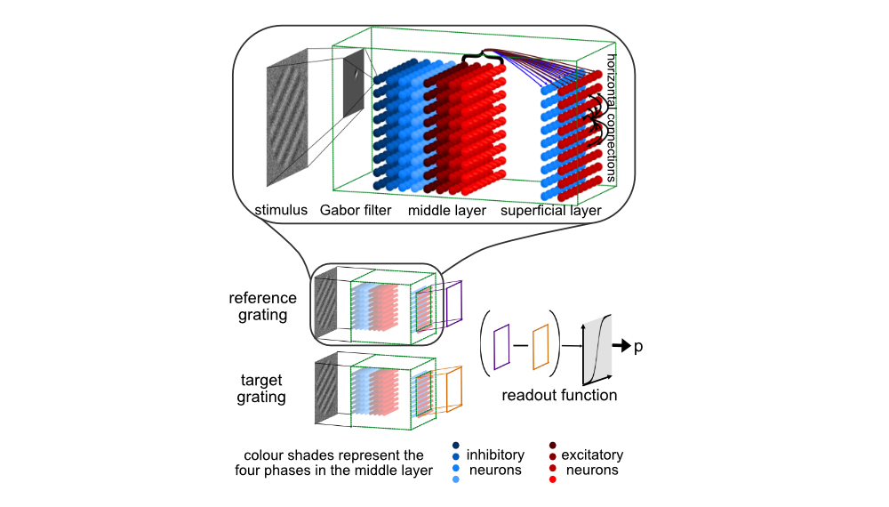

# Documentation on a NN model for Perceptual Learning to better understand layer specific mechanisms in V1

## Table of Contents
- [Project description](#introduction)
- [Usage guide](#usage-guide)
- [Output File Structure](#output-file-structure)
- [Code File structure](#code-file-structure)
- [Required packages](#required-packages)

## Project description

This section provides a summary of the research project that the scripts in this repository support.

**Contributors**

This project was conceived by Yashar Ahmadian and Zoe Kourtzi and was developped by Clara Pecci and myself (Monika Jozsa). The relevant experiments that gave the fundamental questions to this project were done by Ke Jia and Mengxin Wang. We also acknowledge all the participants of the experiments.

**Motivation for our computational model**

Our project aims to replicate experimental results on perceptual learning and provide possible mechanisms that drive those results. We use a biologically-constrained V1 model and investigate the source of increased inhibition, with predictions that could inform future experimental studies.

**Experimental results behind this study**

Jia et al. (2024, Science Advances) used ultra-high-field (UHF-7T) brain imaging and magnetic resonance spectroscopy (MRS) to explore how perceptual decision-making influences functional and neurochemical plasticity. Their study found that participants' ability to discriminate orientations improved with training, particularly for trained orientations. UHF-7T imaging revealed increased signal-to-noise ratios in the superficial layers of V1, while MRS showed a rise in the GABA-to-glutamate ratio across visual areas, linked to performance gains. These findings suggest that enhanced inhibition in V1's superficial layers may drive the learning process. 

**Results of the computational model**
We found that inihibition indeed increases specifically in the superficial layer. Ablation studies showed that the direct readout from superficial layer is the the primary reason for this phenomenon as opposed to other structural differences between the middle and the superficial layers.

### Model Overview

We model V1 as a recurrent network with two layers: the middle (M) and superficial (S) layers. The layers are implemented as Stabilized Supralinear Networks (SSNs) (Rubin and Miller 2015, Ahmadian and Miller 2021) with feedforward connectivity from middle to superficial layers. The SSN is a recurrent network of excitatory (E) and inhibitory (I) neurons with rectified supralinear power-law activation functions that can capture important features of I/O neuronal behaviour.

Visual stimuli (gratings) first activate the M layer, which then feeds forward to the S layer. The response of each layer to their input is the fixed-point response of the SSN. Both layers share a retinotopic 9x9 grid with orientation preferences.

Middle Layer

- **Cells**: 648 cells divided equally between E and I types, each representing simple cells with four phase preferences.
- **Connectivity \(W\)**: Connections are localized within mini-columns; no interaction between different mini-columns or phases.
- **Input \(h\) /Output \(r\)**: Stimuli are processed by Gabor filters and then scaled by constants \(g_E\) and \(g_I\) before they are passed as input \((h)\) to the E and I cells in the SSN; the output is computed as the fixed point of \(\boldsymbol{\tau}\dot{r} = -r + (W r + h)_{+}^n + c^m_{E/I}\), simulated using the Euler method, where \(c^m_{E/I}\) denote baseline input to inhibitory and excitatory cells.

Superficial Layer

- **Cells**: 162 cells divided equally between E and I types, representing complex cells with no phase preference.
- **Connectivity \(W\)**: In addition to the within grid point connections, this layer has long-range horizontal E-to-E and E-to-I connections with strength based on orientation similarity and distances between grid points; E-to-E connections are longer range than E-to-I connections.
- **Input \(h\) /Output \(r\)**: Receives scaled inputs from the M layer, with outputs determined by the fixed-point of \(\boldsymbol{\tau}\dot{r} = -r + (W r + h)_{+}^n+ c^s_{E/I}\), where \(c^s_{E/I}\) denote baseline input to inhibitory and excitatory cells.

The superficial layer outputs to a sigmoid readout layer, aligning with the role of V1’s superficial layers in inter-area feedforward pathways.

*This figure illustrates the model and task schematics.*

### Orientation Discrimination Tasks

We use two tasks to evaluate orientation discrimination:

General Orientation Task 

   - **Objective**: Determine if the second image is rotated clockwise or counter-clockwise relative to the first.
   - **Parameters**: Reference angle \(\alpha\) ranges from \(15^\circ\) to \(165^\circ\), and the offset \(\beta_\text{offset}\) ranges from \(10^\circ\) to \(20^\circ\).

Fine Orientation Task

   - **Objective**: Similar to the general task but with finer distinctions.
   - **Parameters**: Reference angle \(\alpha\) is centered around \(55^\circ\) with small jitter, and \(\beta_\text{offset}\) is adjusted based on model performance.

#### Training Procedure

We use stochastic gradient descent (SGD) to update network parameters. Our loss function combines cross-entropy loss with regularization for biologically plausible activity levels and to maintain network stability. Training consists of two phases:

Pretraining

   - **Purpose**: Initialize parameters for training.  These are then trained for general orientation discrimination.
   - **Parameter initialization**: The initial parameters for pretraining come from a wide range of randomized initialization except for weights and bias of the readout layer which is optimized with logistic regression.

Fine Training

   - **Purpose**: Refine model for fine orientation discrimination.
   - **Parameter initialization**: This phase inherits the parameters from the last step of the pretraining. It does not train the readout weights and bias further
   - **Note**: The readout in the fine training phase is limited to a central \(5 \times 5\) area, unlike the full \(9 \times 9\) grid used in pretraining.

## Usage Guide

This section provides an explanation of how to use the scripts.

1. **Adjust Parameters**:
   - To modify settings for specificity or generalization, update the values in `parameters.py`. Note that PretrainingPars.is_on should be set to True by default (see separating pretraining and training below)

2. **Setup Pretraining**:
   - Define the number of initializations (`num_pretraining`) in `main.py`.
   - Optionally, include a note that will be saved as `note.txt`.

3. **Define Training Configurations**:
   - Adjust the `configurations.py` file to define which configurations should run.

4. **Run the Script**:
   - Execute `main.py` to begin the training and analysis.
   

Separating pretraining and training:
 Pretraining can be run separately from training by only running `main.py` till the end of 'pretraining' section. Then, to run training configurations using an already existing pretraining result, 
      (i) folder_path should be set to the folder corresponding to the pretraining results folder
      (ii) pretraining should be commented out
      (iii) num_training should be set to the num_pretraining minus the number of excluded runs saved to excluded_runs_from_pretraining.csv
      (iv) PretrainingPars.is_on should be set to False in `parameters.py`.
      

## Output File Structure

This section describes the folders and files that the scripts generate arranged ny procedures that generate them.

Running `main.py` generates a new folder within the `results` directory. The folder is named using the current date and a version number, e.g., `Jan08_v0`. This folder is referred to as the `root_folder`. 

#### Contents of the `root_folder`

- **Reproducibility**:
   - `scripts` folder: Contains the state of the scripts at the time the runs were initiated.
   - `notes.txt`: Optional note specified in `main.py`.

- **Initialization Outputs**:
   - `initial_parameters_complete.csv`: Records the initial parameter settings including all runs.
   - `initial_parameters.csv`: Records the initial parameter settings including only non-excluded runs.
   - `orimap_complete.csv`: Contains the orientation mapping data including all runs.
   - `orimap.csv`: Contains the orientation mapping data including only non-excluded runs.

- **Pretraining Outputs**: Note: Although stage 1 is conceptually part of training, it is saved in the pretraining results files for convenience because it is the same accross training configurations.
   - `pretraining_results_complete.csv`: Logs the results of the pretraining, including both stage 0 and stage 1 outputs for all runs.
   - `pretraining_results.csv`: Logs the results of the pretraining, including both stage 0 and stage 1 outputs for only non-excluded runs. 
   - `pretraining_results_val.csv`: Logs the results of the pretraining at validation steps, including additional metrics that are only calculated at validation steps.

- **Run-Exclusion Procedure**:
   - `excluded_runs_from_pretraining.csv`: Run indices of excluded runs. At the end of stages 0 and 1, a procedure is performed to exclude runs that do not meet certain conditions. This procedure also (i) updates `initial_parameters.csv`, `orimap.csv`, and `pretraining_results.csv` to exclude these runs, where the run indices in the updated files are renumbered sequentially (0 to `number of included runs - 1`) and (ii) saves the original files as `initial_parameters_complete.csv`, `orimap_complete.csv`, and `pretraining_results_complete.csv`.

- **Pretraining Analysis Output**:
   - `rel_changes_pretrain.csv`: Relative changes of parameters and metrics before stage 0 and after stage 1.
   - `pretraining_tuning_curves.csv`: Tuning curves at the beginning of stage 0 and at the end of stage 1.
   - `pretraining_tuning_curve_features.csv`: Tuning curve features at the beginning of stage 0 and at the end of stage 1.
   - `pretraining_figures` folder: Figures illustrating the resutls of pretraining. 

List of figures
 
      - **`boxplot_relative_changes`** Boxplots of relative parameter changes during stages 0 and 1 generated by `boxplots_from_csvs` function.
      - **`tc_slope_pretrain_color_by_type`**: Tuning curve slope change preferred orientation vs slope scatter plot and smoothed fitted curve colored by cell type generated by `plot_tc_features` function.
      - **`tc_slope_pretrain_color_by_run_index`**: Tuning curve slope change preferred orientation vs slope scatter plot and smoothed fitted curve colored by run index generated by `plot_tc_features` function.
      - **`tc_slope_pretrain_color_by_pref_ori`**: Tuning curve slope change preferred orientation vs slope scatter plot and smoothed fitted curve colored by preffered orientation generated by `plot_tc_features` function.
      - **`tc_slope_pretrain_color_by_phase`**: Tuning curve slope change preferred orientation vs slope scatter plot and smoothed fitted curve colored by phase generated by `plot_tc_features` function.
      - **`tc_features_pretrain_color_by_type`**: Tuning curve feature pre vs post scatter plots colored by cell type generated by `plot_tc_features` function.
      - **`tc_features_pretrain_color_by_run_index`**: Tuning curve feature pre vs post scatter plots colored by run index generated by `plot_tc_features` function.
      - **`tc_features_pretrain_color_by_pref_ori`**: Tuning curve feature pre vs post scatter plots colored by preffered orientation generated by `plot_tc_features` function.
      - **`tc_features_pretrain_color_by_phase`**: Tuning curve feature pre vs post scatter plots colored by phase generated by `plot_tc_features` function.
      

- **Setting Up Configurations**:
   - `configuration_name` folder: The names of each training configuration is defined in `configurations.py` and a new folder is created for each configuration, named after the configuration.
   - `configuration_name/parameters_{conf_name}.py`:  A copy of the adjusted `parameters.py` file is saved within the configuration folder.

- **Configured Training Output**:
   - `configuration_name/training_results.csv`: Logs the results of the training (stage 2).
   - `configuration_name/training_results_val.csv`: Logs the results of the training (stage 2) at validation steps, including additional metrics that are only calculated at validation steps.

- **Configured Training Analysis Output**:
   - `configuration_name/rel_changes_train.csv`: Relative changes of parameters and metrics before and after stage 2.
   - `configuration_name/tuning_curves.csv`: Tuning curves before and after stage 2.
   - `configuration_name/tuning_curve_features.csv`: Tuning curve features before and after stage 2.
   - `configuration_name/figures` folder: Figures illustrating the resutls of training with the relevant configuration.  

List of figures

      - **`boxplot_relative_changes.png`**: Boxplots of relative parameter changes during training (stage 2) generated by `boxplots_from_csvs` function.
      - **`boxplot_relative_changes_ylim.png`**: Boxplots of relative parameter changes during training (stage 2) with shared y-axis limits generated by `boxplots_from_csvs` function.
      - **`combined_corr_triangles.png`**: Correlation triangles for both layers and orientations between $J$, offset threshold and MVPA scores generated by `plot_corr_triangles` function.
      - **`corr_psychometric_f_c.png`**: Correlation plots between $f$, $c$ parameter changes and psychometric offset threshold generated by `plot_param_offset_correlations` function.
      - **`corr_psychometric_Jcombined.png`**: Correlation plots between aggregated $J$ parameter changes and psychometric offset threshold generated by `plot_param_offset_correlations` function.
      - **`corr_psychometric_Jraw.png`**: Correlation plots between $J$ parameter changes and psychometric offset threshold generated by `plot_param_offset_correlations` function.
      - **`corr_psychometric_kappa_Jsup.png`**: Correlation plots between $\kappa_{J^{sup}}$ parameter changes and psychometric offset threshold generated by `plot_param_offset_correlations` function.
      - **`corr_triangle_mid_125.png`**: Correlation triangle between $J$, offset threshold and MVPA scores for the middle layer and untrained orientation generated by `plot_corr_triangles` function.
      - **`corr_triangle_mid_55.png`**: Correlation triangle between $J$, offset threshold and MVPA scores for the middle layer and trained orientation generated by `plot_corr_triangles` function.
      - **`corr_triangle_sup_125.png`**: Correlation triangle between $J$, offset threshold and MVPA scores for the superficial layer and untrained orientation generated by `plot_corr_triangles` function.
      - **`corr_triangle_sup_55.png`**: Correlation triangle between $J$, offset threshold and MVPA scores for the superficial layer and trained orientation generated by `plot_corr_triangles` function.
      - **`c_f_kappa_f.png`**: Barplots of $c$, $f$ and $\kappa_f$ parameter values before and after training (stage 2) generated by `barplots_from_csvs` function.
      - **`J_pre_post.png`**: Barplots of $J$ parameter values before and after training (stage 2) generated by `barplots_from_csvs` function.
      - **`kappas_Jmidsup.png`**: Barplots of $\kappa$ parameter values before and after training (stage 2) generated by `barplots_from_csvs` function.
      - **`Mahal_scores.png`**: Barplots of Mahalanobis distances for both trained and untrained orientations before and after training (stage 2) generated by `plot_MVPA_or_Mahal_scores` function.
      - **`MVPA_match_paper_fig.png`**: Barplots of MVPA scores for both trained and untrained orientations before and after training (stage 2) generated by `plot_MVPA_or_Mahal_scores_match_Kes_fig` function.
      - **`MVPA_scores.png`**: Barplots of MVPA scores for both trained and untrained orientations before and after training (stage 2) generated by `plot_MVPA_or_Mahal_scores` function.
      - **`offset_pre_post.png`**: Barplots of staircase and psychometric offset thresholds before and after training (stage 2) generated by `barplots_from_csvs` function.
      - **`r_pre_post.png`**: Barplots of mean and max responses before and after training (stage 2) generated by `barplots_from_csvs` function.
      - **`tc_fig.png`**: Example tuning curves generated by `plot_tuning_curves` function. 
      - **`tc_features_train_color_by_phase.png`**: Tuning curve feature pre vs post scatter plots colored by phase generated by `plot_tc_features` function.
      - **`tc_features_train_color_by_pref_ori.png`**: Tuning curve feature pre vs post scatter plots colored by preffered orientation generated by `plot_tc_features` function.
      - **`tc_features_train_color_by_run_index.png`**: Tuning curve feature pre vs post scatter plots colored by run index generated by `plot_tc_features` function.
      - **`tc_features_train_color_by_type.png`**: Tuning curve feature pre vs post scatter plots colored by cell type generated by `plot_tc_features` function.
      - **`tc_slope_train_color_by_phase.png`**: Tuning curve slope change preferred orientation vs slope scatter plot and smoothed fitted curve colored by phase generated by `plot_tc_features` function.
      - **`tc_slope_train_color_by_pref_ori.png`**: Tuning curve slope change preferred orientation vs slope scatter plot and smoothed fitted curve colored by preffered orientation generated by `plot_tc_features` function.
      - **`tc_slope_train_color_by_run_index.png`**: Tuning curve slope change preferred orientation vs slope scatter plot and smoothed fitted curve colored by run index generated by `plot_tc_features` function.
      - **`tc_slope_train_color_by_type.png`**: Tuning curve slope change preferred orientation vs slope scatter plot and smoothed fitted curve colored by cell type generated by `plot_tc_features` function.
      

## Code File Structure

This section describes the content of the folders and files in this repository.

### Root Folder
- **`main.py`**: The main entry point of the project. It calls functions for pretraining, training with different configurations and analysis on the results.
- **`parameters.py`**: Contains parameter definitions used throughout training and analysis. The different training configurations are achieved by changing some of these parameters.
- **`util.py`**: Provides utility functions used across different modules.
- **`configurations.py`**: Defines a function that returns required training configurations

Functions called from `main.py`

- **`save_code`**: Location: `util.py`
- **`main_pretraining`**: Location: `training\main_pretraining.py`
- **`config`**: Location: `configurations.py`
- **`set_up_config_folder`**: Location: `util.py`
- **`configure_parameters_file`**: Location: `util.py`
- **`plot_results_from_csvs`**: Location: `analysis\visualization.py`
- **`barplots_from_csvs`**: Location: `analysis\visualization.py`
- **`main_training`**: Location: `training\main_training.py`
- **`main_tuning_curves`**: Location: `analysis\analysis_functions.py`
- **`save_tc_features`**: Location: `analysis\analysis_functions.py`
- **`main_analysis`**: Location: `analysis\main_analysis.py`

Classes in `parameters.py`

- **`PretrainingPars`**: Parameters specific to pretraining, including the frequency of accuracy checks, batch size, SGD steps, intervals for reference orientation and offset, and other parameters for early stopping criteria.
- **`TrainingPars`**: Parameters specific to training (stage 2), including the frequency of validation, batch size, minimum and maximum SGD steps, and other parameters to handle specific configurations.
- **`ConvPars`**: Parameters related to the convergence of the SSN (Stabilized Supralinear Network), including step size, tolerance, and maximum steps.
- **`LossPars`**: Contains parameters for loss calculations, including regularization constants and firing rate constraints. Note that some of these change after pretraining.
- **`GridPars`**: Defines the 2D grid's size and characteristics, such as distances between grid points (using `xy_distance` function in `parameters.py`), grid size, hypercolumn size and conversion parameters between degrees and millimeters.
- **`FilterPars`**: Parameters for Gabor filters used in the network, including Gaussian standard deviation, scaling parameters for input-to-middle layer and spatial frequency, and conversion parameters between degree of visual field, millimeters and pixel number.
- **`StimuliPars`**: Parameters defining stimulus characteristics, such as radius, contrast, and noise levels.
- **`ReadoutPars`**: Parameters for the readout sigmoid layer, including contributions from different layers, grid sizes, and noise levels (added to responses from layers).
- **`SSNPars`**: General parameters for the middle and superficial layer SSNs, including power law parameters, time constants, number of phases in middle layer and parameters of the superficial layer connectivity matrix. Attributes of this class change  depending on what parameters are trained (they get moved between SSNPars and TrainedSSNPars). This class only contains untrained parameters during training.
- **`TrainedSSNPars`**: Trained parameters. Possible attributes are baseline excitatory and inhibitory constants (cE_m, cI_m, cE_s, cI_s), feedforward weights between middle and superficial layers (f_E, f_I), cell type specific connection strengths (J_2x2_m, J_2x2_s), and shaping parameter for superficial layer horizontal connections (\(\kappa \)).
- **`PretrainedSSNPars`**: Parameters that are pretrained, including baseline excitatory and inhibitory constants (cE_m, cI_m, cE_s, cI_s), feedforward weights between middle and superficial layers (f_E, f_I), and weights and bias for the sigmoid layer.
- **`RandomizePars`**: Defines the ranges for random initialization of parameters such as cell type specific connection strengths (J_2x2_m, J_2x2_s), feedforward weights between middle and superficial layers (f_E, f_I), baseline inhibition and excitation (cE_m, cI_m, cE_s, cI_s), scaling parameter between input and middle layer (gE_m, gI_m) and learning rate. These parameters are all pretrained except for gE_m, gI_m and the learning rate.

 Functions in `util.py`

- **`check_header`**: Checks if a file has header and returns 0 if the file has a header and None if it does not.
- **`unpack_ssn_parameters`**: Unpacks key SSN parameters from a dictionary for trained parameters and a class for untrained parameters, returning them in the desired format.
- **`cosdiff_ring`**: Computes the cosine-based angular distance for a given difference in angular positions.
- **`create_grating_training`**: Generates input grating image for fine orientation discrimination task. It returns a dictionary of reference gratings, target grating, and labels for their relative orientations.
- **`generate_random_pairs`**: Creates random pairs of numbers within a specified range with angular distance from another specified range. This is a helper function for for create_grating_pretraining.
- **`create_grating_pretraining`**: Generates input stimuli for general orientation discrmination task. It returns a dictionary of reference gratings, target grating, and labels for their relative orientations.
- **`sigmoid`**: Computes the sigmoid function.
- **`take_log`**: Takes the logarithm of a matrix with alternating signs. Used for taking log of the $J$ parameters before it enters the loss function.
- **`sep_exponentiate`**: Exponentiates elements of a matrix with alternating signs. Used for exponentiating the $J$ parameters for model evaluation.
- **`save_code`**: Saves the scripts to a designated folder to ensure reproducibility of results. Also creates folder for training results and figures and returns the root foldred path.
- **`save_numpy_to_csv`**: Saves a 4D NumPy array to a csv file. The meaning of dimensions are fixed.
- **`csv_to_numpy`**: Loads a 4D NumPy from a csv file. The meaning of dimensions are fixed.
- **`load_orientation_map`**: Loads an orientation map for a specific training run from a given folder.
- **`load_parameters`**: Loads and parameters to initialize trained parameters dictionary, untrained parameter class and readout parameter dictionary for training or pretraining stages.
- **`filter_for_run_and_stage`**: Filters a DataFrame to retrieve data corresponding to a specific training run and stage.
- **`set_up_config_folder`**: Creates folders for training configurations and copies the necessary files to it.
- **`configure_parameters_file`**: Changes `parameters.py` according to the training configuration. This function moves attributes between `TrainedSSNPars` and `SSNPars` classes and adjust `sup_mid_readout_contrib` in class `ReadoutPars` and `pretraining_task` in class `TrainingPars` depending on the configuration.
- **`update_csv_with_df`**: updates an existing CSV file with a new DataFrame. It allows for new columns but otherwise, keeps the ordering of the original columns.

 Functions in `configurations.py`

- **`config`**: Returns configuration specifications for a group of configurations that is one of the following: special, readout, excluded, only.

### Training Folder
- **`main_pretraining.py`**: This script trains the model (including readout weights) for the general discrimination task on randomized parameters (stage 0). Then, as stage 1, it trains the readout parameters of the model for the fine discrimination task.
- **`main_training.py`**: Contains the main flow for stage 2 training (`main_training`) with a given configuration. Called with subprocess module and takes inputs through command line arguments. This is to enable redefining jax-jit functions that rely on `parameters.py`.
- **`training_functions.py`**: Implements training and evaluation of a two-layer SSN model for the general and the fine orientation discrimination tasks. It includes functions for managing model parameters, calculating loss and accuracy, training the model with SGD, logging results into a DataFrame and saving it to a csv file.
- **`SSN_classes.py`**: Defines classes for modeling Stabilized Supralinear Networks (SSN), focusing on two layers. These classes represent and simulate the dynamics of neural circuits based on shared parameters of neurons and parameters describing the connectivities between neurons.
- **`model.py`**: Provides functions for simulating the response (fixed point) of neurons in both the middle and superficial layers. It includes vectorized versions of these functions to handle batch processing. The functions also compute maximum and mean firing rates that are homeostatic terms in the loss function.
- **`util_gabor.py`**: Utility functions to handle orientation maps, Gabor filters and 

Functions in `main_pretraining.py`

- **`fill_attribute_list`**: Fills the attributes of a class with the provided values.
- **`randomize_mid_params`**: Randomizes parameters for the middle layer of the model, checking that certain inequality and response conditions are met. If conditions are violated, it recursively attempts to find suitable parameters.
- **`randomize_params`**: Randomizes initial parameters for the model, including both middle (by calling `randomize_mid_params`) and superficial layers. It also optimizes readout parameters using logistic regression (by calling `readout_pars_from_regr`), and ensures all randomized parameters satisfy the required conditions.
- **`readout_pars_from_regr`**: Optimizes the readout parameters using logistic regression based on the pretraining general orientation discrimination task.
- **`create_initial_parameters_df`**: Creates or updates a DataFrame with initial parameters used for pretraining and training (parameters at the end of pretraining). The parameters are saved to a CSV file that is accessed at the beginning of training.
- **`exclude_runs`**: Checks for runs that do not meet certain conditions and removes them from the CSV files.
- **`main_pretraining`**: Initializes parameters randomly such that they meet several conditions, and runs stage 0 and 1. 
   

   
Functions called from `main_pretraining` function

   - **`create_readout_init`**: (nested function) Fills up a data dictionary wit readout parameters for the different settings.
   - **`train_ori_discr`**: Main training function running the SGD algorithm. Location: `training/training_functions.py` 
   - **`readout_pars_from_regr`** 
   - **`mean_training_task_acc_test`**:  Location: `training/training_functions.py` 
   - **`offset_at_baseline_acc`**:  Location: `util.py`
   - **`load_parameters`**:  Location: `util.py`
   - **`create_initial_parameters_df`**
   - **`filter_for_run_and_stage`**: Location: `util.py`
   - **`exclude_runs`** 

   

Functions called from `main_training.py`

- **`main_training`**: Runs stage 2 training with the configuration specified in the `parameters.py` file and initial_parameters from the pretraining.
   

   
Functions called from `main_training` function

   - **`load_parameters`**:  Location: `util.py`
   - **`train_ori_discr`**: Main training function running the SGD algorithm. Location: `training/training_functions.py` 

   

 Functions in `training_functions.py`

- **`has_plateaued`**: Checks if the loss or accuracy has plateaued by fitting an exponential decay curve, evaluating the derivative, and performing a Mann-Whitney U test.
- **`append_parameter_lists`**: Appends new values from a parameter dictionary or object to a given list, with optional logarithmic transformation and flattening.
- **`train_ori_discr`**: Trains a two-layer SSN model for orientation discrimination task with settings for either training or pretraining.
- **`loss_and_grad_ori_discr`**: Computes the losses, accuracies, gradients, and other metrics for the orientation discrimination task by generating training data and applying the `jax.loss_and_grad` function to `batch_loss_ori_discr`.
- **`loss_ori_discr`**: Calculates loss, accuracy, and other metrics by evaluating the model response for reference and target data, including noise and applying the sigmoid function.
- **`batch_loss_ori_discr`**: Calls `loss_ori_discr` in a vectorized version to allow for batch processing. Includes optional JIT compilation.
- **`binary_crossentropy_loss`**: Computes binary cross-entropy loss given true and predicted labels.
- **`generate_noise`**: Generates random noise vectors for a batch, serving as an additive noise to the model response.
- **`task_acc_test`**: Tests the model's accuracy on either the general or the fine orientation discrimination task for different stimulus offsets.
- **`mean_training_task_acc_test`**: Averages model accuracy (by calling `task_acc_test`) over multiple samples for a given set of parameters and stimulus offsets.
- **`offset_at_baseline_acc`**: Fits a log-linear curve to accuracy vs. offset data and finds the offset where the curve crosses a threshold accuracy.
- **`make_dataframe`**: Creates a DataFrame from training results, including accuracies, losses, and parameter values, and saves it to a CSV file if specified.

 Classes in `SSN_classes.py`

- **`_SSN_Base`**: A base class for SSN models, containing methods and properties such as neuron parameters, power-law nonlinearity, and functions to calculate the fixed points of the rate vector.
- **`SSN_sup`**: A class representing the superficial layer of the model. It extends `_SSN_Base` and includes methods for generating the recurrent connectivity matrix (`W`) based on spatial and orientation distance, as well as functions for selecting excitatory (`E`) or inhibitory (`I`) neuron types from vectors.
- **`SSN_mid`**: A class representing the middle layer of the model. It also extends `_SSN_Base` and adds specific functionality for handling multiple phases of neurons. It includes methods to create the recurrent connectivity matrix as a block diagonal matrix and functions for selecting excitatory (`E`) or inhibitory (`I`)  neurons across different phases.

 Functions in `model.py`

- **`evaluate_model_response`**: Simulates the response of a two-layer SSN model (middle and superficial layers) to a given stimulus. It returns the fixed points of the neurons from both layers along with related metrics.
- **`vmap_evaluate_model_response`**: A vectorized version of `evaluate_model_response` that allows for batch processing of multiple stimuli inputs simultaneously.
- **`evaluate_model_response_mid`**: Simulates the response of the middle layer of the SSN model to a given stimulus, calculating  the fixed point of neurons. It returns the fixed points and related metrics.
- **`vmap_evaluate_model_response_mid`**: A vectorized version of `evaluate_model_response_mid` for batch processing, similar to `vmap_evaluate_model_response` but focused on the middle layer only.
- **`obtain_fixed_point`**: Calculates the fixed point of an SSN model.
- **`middle_layer_fixed_point`**: Calculates the fixed point of the middle layer of the SSN model.
- **`superficial_layer_fixed_point`**: Calculate the fixed point of the superficial layer of the SSN model.
- **`constant_to_vec`**: Creates a vector from the baseline inihibitory and excitatory constants for the SSN model.

 Functions and classes in `util_gabor.py`

- **`test_uniformity`**: Tests the uniformity of a given orientation map by dividing the orientations into bins and comparing the observed frequencies against expected frequencies using a chi-squared test.
- **`make_orimap`**: Generates an orientation map for a grid by superimposing plane waves, which represent orientations.
- **`save_orimap`**: Saves the generated orientation map to a CSV file, including the run index for traceability.
- **`BW_image_jax_supp`**: Prepares supporting variables for generating black-and-white grating images, such as coordinates and alpha channels, which do not need to be recalculated during the training loop.
- **`BW_image_jax`**: Generates grating images based on given parameters, including orientation and jitter, applying a mask to blend the stimulus with a gray background.
- **`BW_image_jit_noisy`**: Calls the `BW_image_jit` function to generate grating images and adds Gaussian noise to it.
- **`calculate_shifted_coords_mm`**: Calculates shifted coordinates of the 2D grid in millimeters that are centered at a given point.
- **`gabor_filter`**: Creates a Gabor filter at a specified location, orientation, and phase, used for simulating the receptive fields of neurons in the middle layer SSN.
- **`find_gabor_A`**: Calculates a scaling constant for Gabor filters to ensure consistent contrast across stimuli.
- **`create_gabor_filters_ori_map`**: Generates Gabor filters for each orientation and phase in the orientation map (by calling `gabor_filter`). Gebors filters are applied to the stimuli that is then passed to the neurons in the middle layer.
- **`UntrainedPars`**: A class to store parameters that are not trained. This includes grid parameters, stimuli settings, orientation map, Gabor filters, and more.
- **`init_untrained_pars`**: Initializes untrained parameters for the SSN model, either by generating a new orientation map or loading a pre-existing one, and prepares the Gabor filters and other related parameters.
- **`update_untrained_pars`**: Recalculates and/or updates the Gabor filter parameters in the untrained parameters.

### Analysis Folder
- **`main_analysis.py`**: Visualizes and runs analysis on parameter changes, correlations, MVPA scores Mahalanobis distances.
- **`analysis_functions.py`**: Contains the key functions for the analysis and tuning curve calulation.
- **`visualization.py`**: Contains the key functions for visualizing the results and analysis.
- **`pdf_from_images.py`**: Script for putting together saved images into pdfs.   
 
 Nested functions:

   - **`add_multiple_figures_to_page`**: Adds multiple figures (and LaTeX captions/titles) to a PyLaTeX document with scaling support.
   - **`make_pdf_from_figures`**: Creates a PDF file from a list of figures and captions using PyLaTeX, with scaling support
   

 Functions in `main_analysis.py`

- **`main_analysis`**: Runs the analysis for given configurations and number of runs within a given folder.
   

   
 Functions called from `main_analysis` function

   - **`make_exclude_run_csv`**: Location: `analysis.analysis_functions`
   - **`barplots_from_csvs`**: Location: `analysis.visualization`
   - **`boxplots_from_csvs`**: Location: `analysis.visualization`
   - **`plot_param_offset_correlations`**: Location: `analysis.visualization`
   - **`plot_tuning_curves`**: Location: `analysis.visualization`
   - **`plot_tc_features`**: Location: `analysis.visualization`
   - **`main_MVPA`**: Location: `analysis.analysis_functions`
   - **`plot_MVPA_or_Mahal_scores`**: Location: `analysis.visualization`
   - **`plot_MVPA_or_Mahal_scores_match_Kes_fig`**: Location: `analysis.visualization`   
   - **`MVPA_anova`**: Location: `analysis.analysis_functions`
   - **`plot_corr_triangles`**: Location: `analysis.visualization`

 Functions in `analysis_functions.py`

- **`data_from_run`**: Reads CSV files, filters them for run and returns the combined dataframe together with the time indices where stages change. Calls `filter_for_run_and_stage`, `SGD_indices_at_stages`
- **`calc_rel_change_supp`**: Calculates the relative change in a variable between two time points.
- **`rel_change_for_run`**: Calculates the relative changes in the parameters for a single run. Calls `data_from_run`, `calc_rel_change_supp`. 
- **`rel_change_for_runs`**: Calculate the relative changes in parameters for all runs. Calls `rel_change_for_run` and its nested functions: `load_existing_data`, `save_to_csv`.
- **`pre_post_for_runs`**: Calculates the pre and post training values for runs that are not excluded. Calls `data_from_run`
- **`gabor_tuning`**: Calculates the responses of the gabor filters to stimuli with different orientations. Calls `BW_image_jax_supp`, `BW_image_jit`.
- **`tc_grid_point`**: Calculates the responses of the middle and superficial layers to gratings at a single grid point - used for phase matched tuning curve calculation. Calls `BW_image_jax_supp`, `BW_image_jit`, `vmap_evaluate_model_response` and `vmap_evaluate_model_response_mid`. Vmapped version defined as `vmapped_tc_grid_point`.
- **`tuning_curve`**: Calculates responses of middle and superficial layers to gratings (of full images without added noise) with different orientations. Calls `unpack_ssn_parameters`, `SSN_mid`, `SSN_sup` and `vmapped_tc_grid_point`.
- **`save_tc_features`**: Calls compute_features for each stage and run index and saves the results into a CSV file. Calls `check_header` and `compute_features`.
- **`compute_features`**: Computes tuning curve features for each cell. Calls its nested functions.
 
 Nested functions:

   - **`full_width_half_max`**: Calculates width of tuning curve at half-maximum. This method should not be applied when tuning curve has multiple bumps. 
   - **`tc_cubic`**: Cubic interpolation of tuning curve data.
   

- **`param_offset_correlations`**: Calculates the Pearson correlation coefficient between the offset threshold and the parameters. Calls `rel_change_for_runs`, and its nested function: `calculate_correlations`: Calculates correlation coefficient between a main variable and given parameters.
- **`MVPA_param_offset_correlations`**: Calculates the Pearson correlation coefficient between the offset threshold, the parameter differences and the MVPA scores. Calls `rel_change_for_runs`, `csv_to_numpy`, 
- **`select_type_mid`**: Selects the excitatory or inhibitory cell responses. Vmapped version defined as `vmap_select_type_mid`.
- **`gaussian_filter_jax`**: Applies Gaussian filter to a 2D JAX array (image). Calls its nested function `gaussian_kernel`: Generates a 2D Gaussian kernel.
- **`smooth_trial`**: Smooths a single trial of responses over grid points. Calls `gaussian_filter_jax`. Vmapped version defined as `vmap_smooth_trial`.
- **`vmap_model_response`**: Generates model response for a given orientation and noise level. Calls `BW_image_jit_noisy`, `SSN_mid`, `SSN_sup` and `vmap_evaluate_model_response`.
- **`SGD_indices_at_stages`**: Gets the indices of the SGD steps at the end and beginning of stages.
- **`select_response`**: Selects the response for a given SGD step, layer and ori from the responses dictionary. If the dictionary has ref and target responses, it returns the difference between them.   
- **`mahal`**: Returns the Mahalanobis distance (in squared units) of each observation in a dataset from the sample data.
- **`filtered_model_response`**: Calculates filtered model response for each orientation in a given orientation list and for each required parameter set. Calls `load_parameters`, `vmap_model_response`, `generate_noise`, `vmap_select_type_mid` and its nested function `smooth_data`: Smooth data matrix over grid points. Data is reshaped into 9x9 grid before smoothing and then flattened again. Calls `vmap_smooth_trial`.
- **`MVPA_Mahal_analysis`**: Calculates MVPA and Mahalanobis distances for each run and layer at different stages of training. Calls `filtered_model_response`, `mahal`. NOTE: MVPA is based on `sklearn.linear_model.SGDClassifier`.
- **`MVPA_anova`**: Performs two-way ANOVA on MVPA or Mahalanobis scores to measure the effect of SGD steps and orientation. Calls `csv_to_numpy`
- **`make_exclude_run_csv`**: Creates a csv file with the indices of the runs that should be excluded from the analysis based on missing data and the offset condition. Calls `data_from_run`
- **`main_tuning_curves`**: Calculates tuning curves for the different runs and different stages in each run. Calls `load_parameters` and `tuning_curve`.
- **`main_MVPA`**: Calculates MVPA scores for before pretraining, after pretraining and after training - score should increase for trained ori more than for other two oris especially in superficial layer. Calls `MVPA_Mahal_analysis`, `save_numpy_to_csv`, `csv_to_numpy`.
- **`get_psychometric_threshold_for_configs`**: This function calculates the mean psychometric threshold of the last three values for different configurations.

 Functions in `visualization.py`

- **`axes_format`**: This function formats the axes of the plot based on the input parameters.
- **`annotate_bar`**: This function annotates bars of a barplot with their values.
`plot_results_from_csv`: This funcitons plots the results on the parameters from a single run from a given csv file. It calls `rel_change_for_run` from `analysis_functions.py`, `annotate_bar`, and its nested funtions. 

 Nested functions:

   - **`plot_params_over_time`**: This function plots parameters changes over time.
   - **`plot_accuracy`**: This function plots accuracy changes over time.
   - **`plot_loss`**: This function plots loss changes over time
   - **`plot_offset`**: This function plots offset changes over time.
   - **`plot_readout_weights`**: This function plots readout bias and weights over time.
   

- **`plot_results_from_csvs`**: This function loops over runs and plots the per-run results from the given csv file. It calls `plot_results_from_csv`.
- **`barplots_from_csvs`**: This function plots bar plots of the parameters before and after training or pretraining over given (not-excluded) runs. It calls `pre_post_for_runs` from `analysis_functions.py` and its nested functions. 

 Nested functions:

   - **`scatter_data_with_lines`**: This function adds points to barplots for values before and after a training stage and connects those points with lines.
   - **`barplot_params`**: This function plots bar plots of the parameters for mean values before and after training stages.
   

- **`boxplots_from_csvs`**: This function creates boxplots and barplots for the relative changes of the parameters before and after training stages. It defines groups of parameters and calls its nested function `boxplot_params` to make the boxplots on those groups.
- **`plot_tuning_curves`**: This function plots example tuning curves for middle and superficial layer cells at different stages of training
- **`plot_tc_features`**: This functions plots tuning curve features for excitatory and inhibitory cells at different stages of training. It calls `check_header` from `util.py` and its nested functions. 

 Nested functions:

   - **`sliding_mannwhitney`**: This function perform Mann-Whitney U-test on intervals of a sliding window and returns the centers of the intervals with the corresponding p-values.
   - **`shift_x_data`**: This function shifts circular data by a given value and centers it around the new 0.
   - **`scatter_feature`**: This function creates scatter plots of a given tuning curve feature for excitatory and inhibitory cells.
   - **`lowess_feature`**: This function plots smoothed features for excitatory and inhibitory cells separately.
   - **`mesh_for_feature`**: This function filters data for a given feature.
   

- **`match_keys_to_labels`**: This function matches given keys to LaTeX notation.
- **`plot_param_offset_correlations`**: This function plots the correlations between the psychometric offset threshold and the model parameters. 

 Nested functions:

   - **`get_color`**: Determines a color based on correlation value and significance.
   - **`regplots`**: Plots the regression plot for a given parameter and the psychometric offset threshold.
   - **`save_fig`**: Saves the figure with given filename and title and closes it.
   

- **`plot_correlations`**:  This function plots the correlations between the psychometric offset threshold and the model parameters. It calls `MVPA_param_offset_correlations` from `analysis_functions.py`, and `axes_format`.
- **`plot_corr_triangle`**: This function plots a correlation triangle for given keys. It calls `match_keys_to_labels`, `axes_format`
- **`plot_corr_triangles`**: This function plots four correlation triangles for the two orientations and layers into a single figure. It calls `csv_to_numpy` from `util.py`, `rel_change_for_runs` from `analysis_functions`, and `plot_corr_triangle`.
- **`plot_MVPA_or_Mahal_scores`**: This function plots the MVPA scores or Mahalanobis distances for the two layers and two orientations with data points and lines between them. It calls `csv_to_numpy` from `util.py`.
- **`plot_MVPA_or_Mahal_scores_match_Kes_fig`**: This function plots the MVPA scores or Mahalanobis distances for the two layers and two orientations in the format of Ke's 2024 paper. It calls `csv_to_numpy` from `util.py`.
- **`plot_threshold_from_ablation`**: This function  plots the threshold changes for the different ablation configurations.

## Required packages

The following python packages were used for the project:

- **`numpy`**: version 1.26.3
- **`pandas`**: version 2.1.4
- **`scikit-learn`**: version 1.3.0
- **`seaborn`**: version 0.12.2
- **`statsmodels`**: version 0.14.1 
- **`scipy`**: version 1.11.4
- **`matplotlib`**: version 3.8.2 
- **`jax`**: version 0.4.27  
- **`optax`**: version 0.2.2 